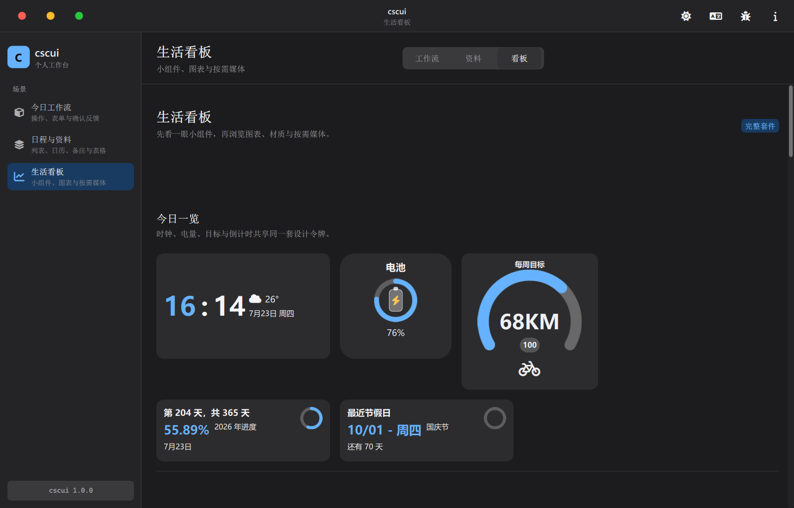

# cscui

基于 Qt Quick 的桌面组件工作台：可复用控件、明暗主题、中英切换、运行时检查器，以及面向真实场景的组件演示。

仓库：https://github.com/chen66663/cscui-

---

## 界面预览

### 今日工作流（浅色）

表单、操作、状态标签、进度与空状态等常用控件。


### 日程与资料（深色）

列表、导航、日历、表格、轮播与备注等数据/内容组件。


### 生活看板（深色）

图表、小组件、材质卡片、动画窗口与媒体演示。



---

## 功能概览

- **三场景导航**：今日工作流 / 日程与资料 / 生活看板（`--page core|light|extended`）
- **主题与无障碍**：浅色 / 深色 / 自动；高对比、减少动态效果
- **中英切换**：`Theme.localized` + 界面一键切换
- **无边框窗口**：红绿灯按钮、拖拽移动、最大化还原
- **组件身份角标**：悬停时在组件外侧显示名称（Overlay，不挡操作）
- **丝滑切页**：单树入场动画（透明度 + 位移 + 微缩放）；`reducedMotion` 时关闭
- **运行时检查器**：`--debug-ui` 或 `Ctrl+Shift+D`（布局边界、事件日志、FPS 采样等）
- **媒体（按需）**：本地音乐扫描走后台低优先级线程池，支持取消与有界缓存

---

## 环境要求

| 项 | 版本 |
|----|------|
| Qt | **6.8+**（Quick、Multimedia、Network、Concurrent） |
| CMake | **3.24+** |
| 编译器 | C++17（MSVC / MinGW / Clang 等） |
| 可选 | Font Awesome 6 桌面字体（仓库已含 `fonts/`） |

---

## 构建与运行

```bash
cmake -S . -B build -DCMAKE_PREFIX_PATH=<Qt安装路径>
cmake --build build --config RelWithDebInfo --parallel
```

可执行文件：`build/cscui`（Windows 为 `build/cscui.exe`）。

```bash
# 直接运行
./build/cscui

# 深色 + 中文 + 看板页 + 检查器
./build/cscui --theme dark --language zh --page extended --debug-ui

# 截图（用于文档 / 冒烟）
./build/cscui --page core --theme light --language zh --window-size 1280x820 --screenshot preview/shot.png
```

### 常用命令行参数

| 参数 | 说明 |
|------|------|
| `--page core|light|extended`（或 `0|1|2`） | 启动页 |
| `--theme light|dark|auto` | 主题 |
| `--language en|zh|auto` | 语言 |
| `--debug-ui` | 打开 UI 检查器 |
| `--window-size WxH` | 窗口尺寸，如 `1280x820` |
| `--screenshot path` | 就绪后截图并退出 |

---

## 工程结构

```
.
├── Main.qml              # 无边框壳层、导航、切页、预加载、滚轮
├── main.cpp              # 启动参数、主题桥接、截图
├── components/           # 可复用组件 + 工作台辅助控件（Csc*）
├── pages/                # 三个演示场景
│   ├── BaseComponents.qml          # 今日工作流
│   ├── NoBackgroundComponents.qml  # 日程与资料
│   └── OtherComponents.qml         # 生活看板
├── core/                 # 音乐库扫描等 C++ 服务
├── docs/DESIGN_SYSTEM.md # 设计令牌与交互契约
├── fonts/                # 图标字体与演示图片
├── preview/              # 预览截图
├── scaffold/             # 应用脚手架模板
└── tools/                # 新建工程脚本
```

---

## 组件清单（47）

### 基础与表单

`Button` · `Input` · `SearchField` · `Dropdown` · `CheckBox` · `RadioButton` · `SwitchButton` · `Slider` · `MenuButton` · `Tag` · `ProgressBar` · `Divider`

### 反馈与容器

`Toast` · `AlertDialog` · `LoadingIndicator` · `Accordion` · `Card` · `CardWithTextArea` · `HoverCard` · `BlurCard` · `Drawer` · `EmptyState`

### 数据与导航

`List` · `NavBar` · `DataTable` · `Calendar` · `SimpleDatePicker` · `Carousel` · `Avatar`

### 图表与小组件

`AreaChart` · `BarChart` · `PieChart` · `Clock` · `ClockCard` · `TimeDisplay` · `BatteryCard` · `FitnessProgress` · `YearProgress` · `NextHolidayCountdown` · `HitokotoCard` · `ColorPicker`

### 媒体与窗口

`MusicPlayer` · `Playlist` · `MusicWindow` · `AnimatedWindow` · `Aboutme` · `Theme`

工作台内部还有 `Csc*` 辅助控件（分区标题、滚动条、分段控件、调试面板、身份角标等），不单独作为业务组件导出。

---

## 使用方式

### 模块导入（构建为 QML 模块后）

```qml
import cscui 1.0

Button {
    theme: appTheme
    text: "Continue"
}
```

### 源码旁路导入

```qml
import "components" as Components

Components.Button {
    theme: theme
    text: "继续"
}
```

资源前缀：`qrc:/cscui/`（字体、图片等）。

主题通过 `Theme` 对象注入；组件使用 `theme.localized("English", "中文")` 做文案。

---

## 设计要点

详见 [docs/DESIGN_SYSTEM.md](docs/DESIGN_SYSTEM.md)。

- 语义色、间距、圆角、字号统一在 `Theme.qml`
- 动效只改 opacity / transform；`reducedMotion` 时时长为 0
- 切页只动画**入场页**，旧页立刻隐藏，避免双页同帧绘制

---

## 多线程模型（重点）

本项目遵循 Qt Quick 硬约束：**场景图与 QML 对象只活在 GUI 线程**。后台线程只做「可序列化的值计算」（路径列表、封面缩放写盘、歌词文本），结果经 `QFutureWatcher` / 信号回到 GUI 再改模型。

### 线程划分

| 线程 | 职责 | 实现 |
|------|------|------|
| **GUI** | QML、动画、列表模型、播放器 UI | Qt Quick 主循环 |
| **扫盘池** `musicScanThreadPool` | 递归枚举音频文件 | `QThreadPool`，`maxThreadCount = 1`，`LowPriority` |
| **媒体池** `musicMediaThreadPool` | 封面 JPG 写出、歌词读取 | 同样 **1 线程**、低优先级、30s 空闲回收 |

两个池都在 `core/music.cpp` 内静态构造，**故意串行**：目录 walk 与磁盘 IO 争带宽时，多开线程只会拖垮渲染帧。

任务入口统一为：

```cpp
QtConcurrent::run(musicScanThreadPool(), /* capture values + token */ ...);
// 或 musicMediaThreadPool()
```

### 协作取消与代际号

后台 lambda **不捕获 `this` / QObject\***，只捕获：

- 值类型参数（路径列表、布尔递归标志等）
- `std::shared_ptr<std::atomic_bool>` 取消令牌

析构或新请求到来时：

1. `generation++`（扫描 / 封面 / 歌词各自维护）
2. `cancellation->store(true)`
3. `QFutureWatcher::cancel()` + `disconnect`
4. **绝不在 GUI 上 `wait()` 慢盘**

完成回调里若 `generation != 当前代` 或 token 已取消，则丢弃结果；过期封面临时文件会 `QFile::remove`。

并发扫描请求合并：进行中再来扫描只记 `m_pendingScan*`，当前任务结束后只启动**最新一代**，避免队列堆积。

### UI 侧「异步」而不是「多线程」

页面与重 UI **不**放到 C++ 线程里建：

| 机制 | 作用 |
|------|------|
| `Loader.asynchronous: true` | 页面在空闲帧孵化，导航不堵死 |
| `activatedPages` + 顺序预加载 | 后台暖下一页，切换时尽量已 Ready |
| 切页单树动画 | 只绘制入场 Loader，降低 fill-rate |
| `Qt.callLater` | 日志、布局 `returnToBounds` 等延后到下一拍 |

这是 Qt Quick 上更稳妥的「并行感」：后台负责 IO，GUI 负责增量上屏。

---

## 内存管理（重点）

### 有界缓存（硬上限）

定义于 `core/music.cpp`：

| 常量 | 上限 | 含义 |
|------|------|------|
| `kMaxMetadataCacheSize` | **2048** | 元数据缓存条目 |
| `kMaxMetadataQueueSize` | **256** | 元数据预取队列 |
| `kMaxLyricsFileBytes` | **2 MiB** | 单歌词文件读取上限 |
| `kCoverMaximumEdge` | **640 px** | 封面最长边，写出前缩放 |
| `kMaxIncrementalDiffInputFiles` | **1024** | 超过则不做逐文件 diff |
| `kMaxIncrementalFileEvents` | **128** | 增量 fileAdded/Removed 上限 |

大库变更优先发**整表快照** `musicFilesChanged`，避免在 GUI 线程上对上万路径建 `QSet` 做差。

### 临时资源与所有权

- **封面**：worker 写出 `%TEMP%/cscui-cover-*.jpg`；换源/析构/过期 generation 时删除旧文件  
- **QObject 树**：播放器、Watcher、Timer 一律父子归属，随页面销毁  
- **Worker 生命周期**：与 `MusicLibrary` 解耦，靠 token + generation，页面关掉也不 join 线程  

### QML / 场景图侧

| 策略 | 位置 / 说明 |
|------|-------------|
| 列表复用 | `ListView { reuseItems: true; cacheBuffer: ... }`（`DataTable`、`List`、菜单等） |
| 图片解码 | `asynchronous: true`，`sourceSize` 贴近显示尺寸（如 `Avatar`、`Carousel`） |
| 图标字体 | 壳层 `FontLoader` 一次；`Theme.iconFamily()` / `iconSource()`，有共享字体时组件不再重复加载 OTF |
| 阴影 / 模糊 | `MultiEffect` / `layer` 在 `shadowEnabled == false` 或 highContrast 时关闭 |
| 媒体默认关 | 看板里 `MusicPlayer` 需用户打开开关才扫描本地库 |
| 身份角标 | `Popup` 挂在 `Overlay`，不增加业务组件内部 layer |

### 滚动与首屏

- `contentHeight` 用 `max(loader.height, item.implicitHeight, item.height)`，避免首帧「滚不动」  
- 活动页在淡入全程保持 `enabled`，滚轮可用  
- `WheelHandler` 保证在子控件未处理滚轮时外层列表仍滚动（Windows 常见问题）  

---

## 一句话架构

> **GUI 拥有对象与像素；后台只产出有界、可丢弃的值；过期结果靠 generation 扔掉，从不阻塞析构。**

---

## 脚手架

```powershell
.\tools\New-CscuiProject.ps1 -Name SampleApp -Destination . -Template basic -NonInteractive
```

模板：`basic` / `mobile` / `productivity`（见 `scaffold/templates/`）。

---

## 许可证

见 [LICENSE](LICENSE)。
