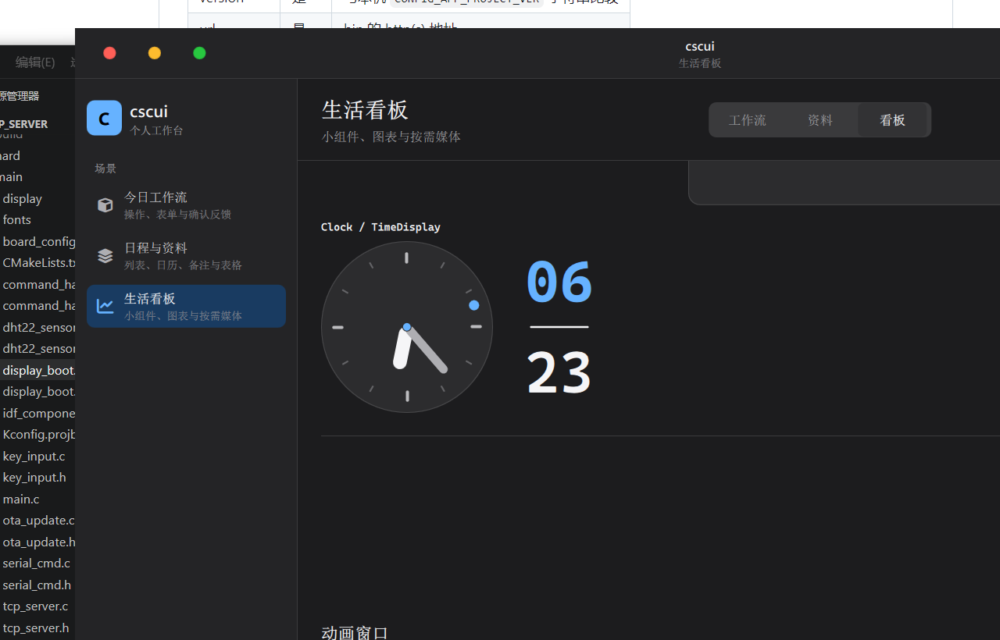
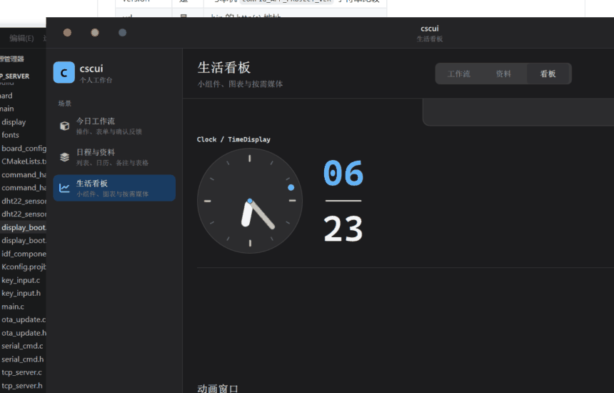

# cscui

**Qt Quick 桌面组件工作台**

47 个可复用控件 · 明暗主题 · 中英界面 · 运行时检查器 · 场景化演示

<p align="center">
  <a href="https://github.com/chen66663/cscui-"></a>
  
  
</p>

---

## 预览

### 三个场景

| 今日工作流 | 日程与资料 | 生活看板 |
|:----------:|:----------:|:--------:|
|  |  |  |
| 表单 · 搜索 · 标签 · 进度 | 列表 · 日历 · 表格 · 轮播 | 图表 · 小组件 · 媒体 |

### 浅色 / 深色

#### 今日工作流

<p align="center">
  
  
</p>

#### 日程与资料

<p align="center">
  
  
</p>

#### 生活看板

<p align="center">
  
  
</p>

### 动画窗口（共享元素过渡）

左侧触发按钮（含不同圆角方块）+ 右侧可调参数（时长 / 延迟 / 淡入 / 关闭 / 位移）。点击后从按钮 morph 到全屏窗口，动画只改 transform、颜色与不透明度。

**参数面板**

<p align="center">
  
</p>

**开窗过渡**

<p align="center">
  
</p>

### 检查器 · 窄屏

<p align="center">
  
  
</p>

---

## 功能

| 能力 | 说明 |
|------|------|
| 场景导航 | 工作流 / 资料 / 看板 |
| 主题 | 浅色 · 深色 · 跟随系统；高对比 / 减少动态效果 |
| 语言 | 中 / 英 |
| 窗口 | 无边框、红绿灯、拖拽、最大化还原 |
| 组件名 | 悬停时在外侧显示名称 |
| 动画窗口 | 可调参数的共享元素过渡 |
| 检查器 | `Ctrl+Shift+D` 或 `--debug-ui` |
| 媒体 | 本地音乐按需加载 |

---

## 快速开始

**依赖**：Qt **6.8+**（Quick / Multimedia / Network / Concurrent）· CMake **3.24+** · C++17

```bash
cmake -S . -B build -DCMAKE_PREFIX_PATH=<Qt路径>
cmake --build build --config RelWithDebInfo --parallel
build/cscui        # Windows: build\cscui.exe
```

```bash
# 深色 + 中文 + 看板 + 检查器
cscui --theme dark --language zh --page extended --debug-ui

# 截图
cscui --page core --theme light --language zh --window-size 1280x820 --screenshot out.png
```

| 参数 | 含义 |
|------|------|
| `--page core | light | extended` | 启动页（`0 | 1 | 2`） |
| `--theme light | dark | auto` | 主题 |
| `--language en | zh | auto` | 语言 |
| `--debug-ui` | 检查器 |
| `--window-size WxH` | 窗口大小 |
| `--screenshot path` | 截图后退出 |

---

## 目录

```
Main.qml / main.cpp   # 壳层与 CLI
components/           # 业务组件 + Csc* 辅助控件
pages/                # 三个演示场景
core/                 # C++ 服务（音乐库等）
docs/DESIGN_SYSTEM.md # 设计令牌
fonts/ · preview/     # 字体与截图
scaffold/ · tools/    # 模板与脚手架
```

---

## 组件（47）

**表单**  
`Button` · `Input` · `SearchField` · `Dropdown` · `CheckBox` · `RadioButton` · `SwitchButton` · `Slider` · `MenuButton` · `Tag` · `ProgressBar` · `Divider`

**反馈与容器**  
`Toast` · `AlertDialog` · `LoadingIndicator` · `Accordion` · `Card` · `CardWithTextArea` · `HoverCard` · `BlurCard` · `Drawer` · `EmptyState`

**数据与导航**  
`List` · `NavBar` · `DataTable` · `Calendar` · `SimpleDatePicker` · `Carousel` · `Avatar`

**图表与小组件**  
`AreaChart` · `BarChart` · `PieChart` · `Clock` · `ClockCard` · `TimeDisplay` · `BatteryCard` · `FitnessProgress` · `YearProgress` · `NextHolidayCountdown` · `HitokotoCard` · `ColorPicker`

**媒体与系统**  
`MusicPlayer` · `Playlist` · `MusicWindow` · `AnimatedWindow` · `Aboutme` · `Theme`

另有 `Csc*` 工作台控件（分区、滚动条、分段条、调试面板、身份角标）。设计细节见 [docs/DESIGN_SYSTEM.md](docs/DESIGN_SYSTEM.md)。

---

## 在项目中使用

```qml
import cscui 1.0

Button {
    theme: appTheme
    text: "Continue"
}
```

```qml
import "components" as Components

Components.Button {
    theme: theme
    text: "继续"
}
```

资源前缀：`qrc:/cscui/`。

---

## 新建工程

```powershell
.\tools\New-CscuiProject.ps1 -Name SampleApp -Destination . -Template basic -NonInteractive
```

模板：`basic` · `mobile` · `productivity`

---

## 许可证

见 [LICENSE](LICENSE)。
