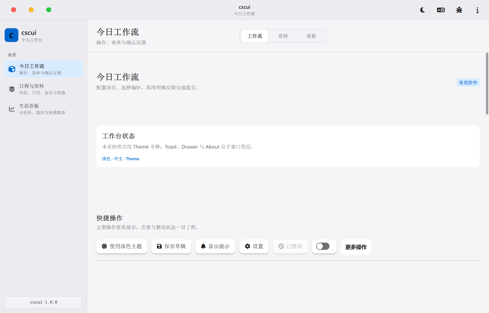
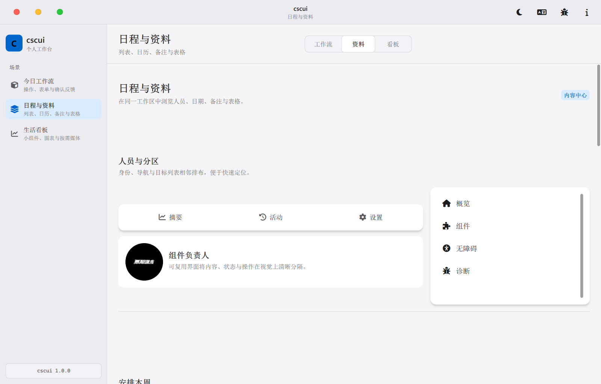
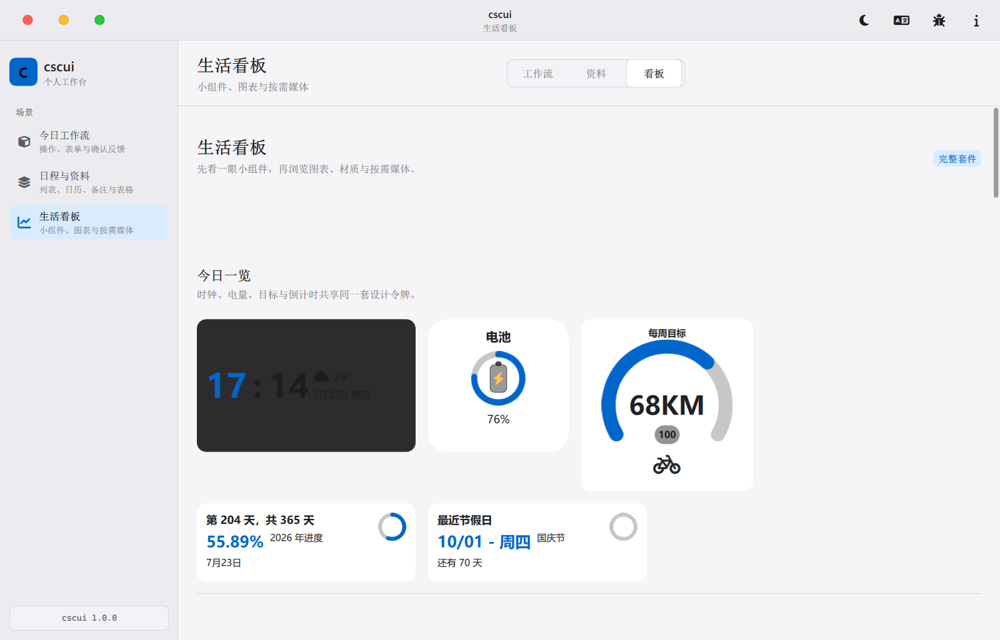
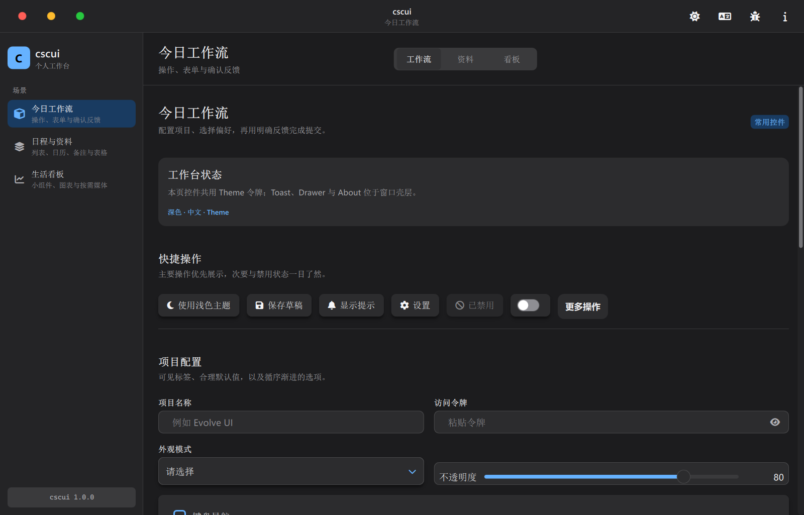
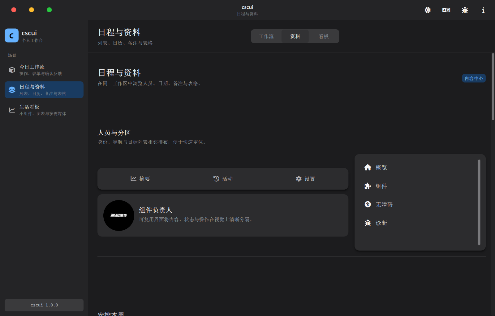
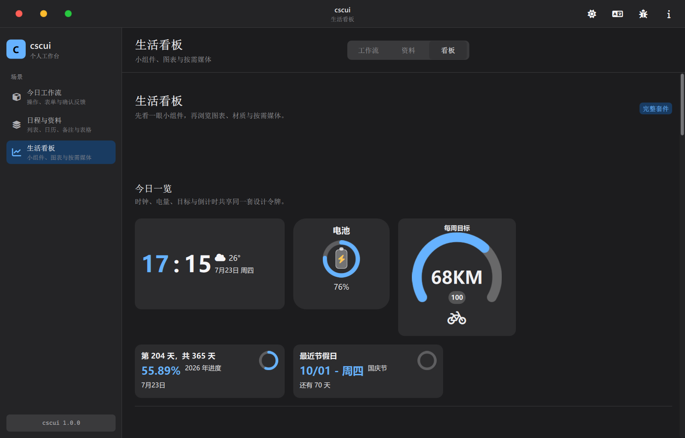
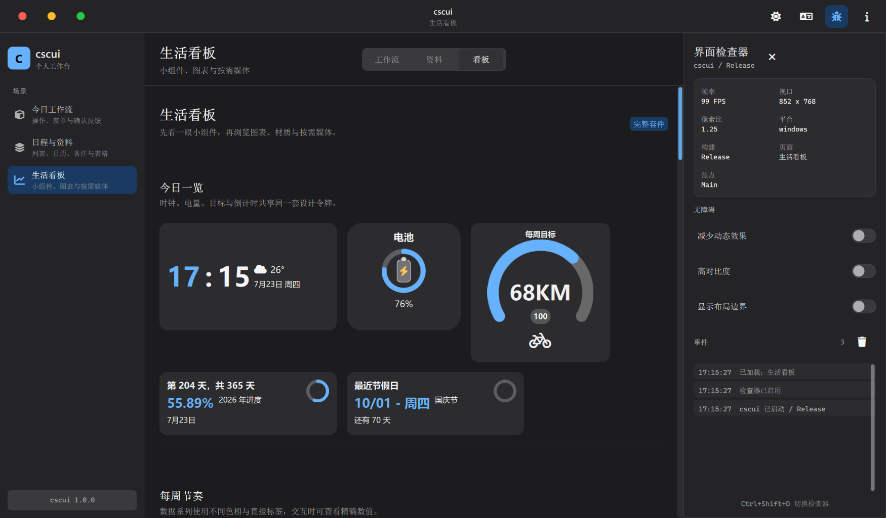
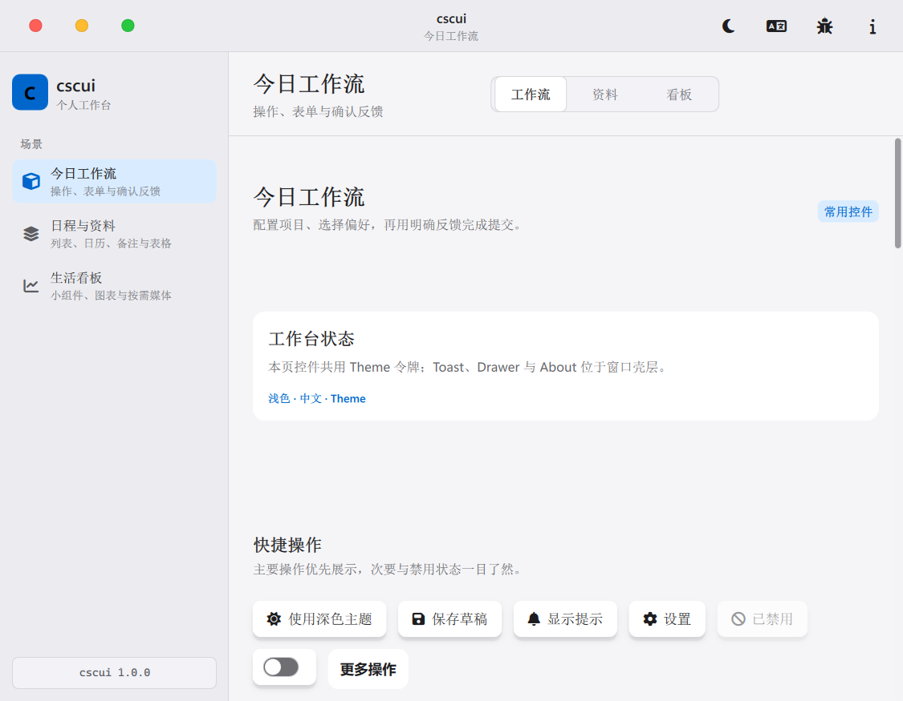

# cscui

**Qt Quick 桌面组件工作台** — 47 个可复用控件 · 明暗主题 · 中英切换 · 运行时检查器 · 真实场景演示

[](https://github.com/chen66663/cscui-)

---

## 预览

### 三场景一览

| 今日工作流 | 日程与资料 | 生活看板 |
|:---:|:---:|:---:|
|  |  |  |
| 表单 · 操作 · 状态 · 进度 | 列表 · 日历 · 表格 · 轮播 | 图表 · 小组件 · 媒体 |

### 浅色 / 深色

<p align="center">
  
  
</p>

<p align="center">
  
  
</p>

<p align="center">
  
  
</p>

### 检查器与窄屏

<p align="center">
  
  
</p>

| 运行时检查器（`--debug-ui`） | 窄窗口（紧凑导航） |
|:---:|:---:|
| 布局边界 · 事件日志 · FPS | 侧栏自动收成图标轨 |

---

## 功能

- **三场景导航**：今日工作流 / 日程与资料 / 生活看板
- **主题**：浅色 · 深色 · 跟随系统；高对比 / 减少动态效果
- **中英切换**：`Theme.localized`，界面一键切换
- **无边框窗口**：红绿灯、拖拽、最大化还原
- **悬停组件名**：外侧浮层角标，不挡操作
- **切页动效**：单树淡入 + 位移 + 微缩放
- **检查器**：`Ctrl+Shift+D` 或 `--debug-ui`
- **按需媒体**：本地音乐扫描可开关，后台线程执行

---

## 快速开始

### 环境

| 依赖 | 版本 |
|------|------|
| Qt | 6.8+（Quick / Multimedia / Network / Concurrent） |
| CMake | 3.24+ |
| C++ | 17 |

### 构建

```bash
cmake -S . -B build -DCMAKE_PREFIX_PATH=<Qt路径>
cmake --build build --config RelWithDebInfo --parallel
./build/cscui   # Windows: build\cscui.exe
```

### 常用参数

```bash
# 深色 + 中文 + 看板 + 检查器
./build/cscui --theme dark --language zh --page extended --debug-ui

# 截图冒烟
./build/cscui --page core --theme light --language zh \
  --window-size 1280x820 --screenshot preview/shot.png
```

| 参数 | 说明 |
|------|------|
| `--page core|light|extended` | 启动页（也可用 `0|1|2`） |
| `--theme light|dark|auto` | 主题 |
| `--language en|zh|auto` | 语言 |
| `--debug-ui` | 打开检查器 |
| `--window-size WxH` | 窗口尺寸 |
| `--screenshot path` | 就绪后截图退出 |

---

## 工程结构

```
.
├── Main.qml / main.cpp     # 壳层、导航、预加载、CLI
├── components/             # 业务组件 + Csc* 工作台控件
├── pages/                  # 三个演示场景
├── core/                   # 音乐扫描等 C++ 服务
├── docs/DESIGN_SYSTEM.md   # 设计令牌与交互契约
├── fonts/ · preview/       # 字体、演示图、文档截图
├── scaffold/ · tools/      # 脚手架与工程生成脚本
└── CMakeLists.txt
```

---

## 组件（47）

### 表单与操作

`Button` · `Input` · `SearchField` · `Dropdown` · `CheckBox` · `RadioButton` · `SwitchButton` · `Slider` · `MenuButton` · `Tag` · `ProgressBar` · `Divider`

### 反馈与容器

`Toast` · `AlertDialog` · `LoadingIndicator` · `Accordion` · `Card` · `CardWithTextArea` · `HoverCard` · `BlurCard` · `Drawer` · `EmptyState`

### 数据与导航

`List` · `NavBar` · `DataTable` · `Calendar` · `SimpleDatePicker` · `Carousel` · `Avatar`

### 图表与小组件

`AreaChart` · `BarChart` · `PieChart` · `Clock` · `ClockCard` · `TimeDisplay` · `BatteryCard` · `FitnessProgress` · `YearProgress` · `NextHolidayCountdown` · `HitokotoCard` · `ColorPicker`

### 媒体与系统

`MusicPlayer` · `Playlist` · `MusicWindow` · `AnimatedWindow` · `Aboutme` · `Theme`

> 另有 `Csc*` 工作台辅助控件（分区、滚动条、分段条、调试面板、身份角标等）。

---

## 多线程模型

**硬约束**：QML / 场景图只在 GUI 线程。后台只做值计算，结果回 GUI 再改模型。

| 线程 | 职责 | 配置 |
|------|------|------|
| GUI | 界面、动画、模型 | Qt Quick 主循环 |
| `musicScanThreadPool` | 递归扫音频 | **1 线程** · `LowPriority` |
| `musicMediaThreadPool` | 封面写出、歌词读 | **1 线程** · `LowPriority` |

实现要点（`core/music.cpp`）：

- `QtConcurrent::run(pool, ...)`，lambda **只捕获值 + `shared_ptr<atomic_bool>`**
- **generation 代际号**：过期结果直接丢弃；析构只 cancel，**不 wait 磁盘**
- 扫描中再请求 → 记 pending，结束后只跑**最新一代**

UI 侧异步（不是乱开线程）：

- `Loader.asynchronous` + 顺序预加载页面
- 切页只绘入场页（淡入 / 位移 / 微缩放）
- `Qt.callLater` 延后非关键工作

---

## 内存管理

### 有界缓存（`music.cpp`）

| 常量 | 上限 | 用途 |
|------|------|------|
| `kMaxMetadataCacheSize` | 2048 | 元数据缓存 |
| `kMaxMetadataQueueSize` | 256 | 预取队列 |
| `kMaxLyricsFileBytes` | 2 MiB | 单歌词文件 |
| `kCoverMaximumEdge` | 640 px | 封面缩放后再存 |
| `kMaxIncrementalDiffInputFiles` | 1024 | 超限不做逐文件 diff |

大库变更优先 **整表快照** `musicFilesChanged`，避免 GUI 上巨型 `QSet` 差集。

### 场景图与资源

- 列表：`reuseItems` + `cacheBuffer`
- 图片：`asynchronous` + `sourceSize` 贴近显示尺寸
- 字体：壳层加载一次，`Theme.iconFamily()` / `iconSource()` 共享
- 阴影/模糊：不用时关 `layer` / `MultiEffect`
- 媒体默认关闭，用户打开再扫本地库
- 角标在 `Overlay`，不增加组件内部 layer

### 滚动

- `contentHeight` 用 `max(loader / implicit / height)`，避免首帧滚不动
- 淡入全程保持页面 `enabled`；`WheelHandler` 兜底外层滚动

**一句话**：GUI 拥有对象与像素；后台只产出有界、可丢弃的值；过期靠 generation 扔掉，析构从不阻塞。

---

## 嵌入使用

```qml
import cscui 1.0

Button {
    theme: appTheme
    text: "Continue"
}
```

或：

```qml
import "components" as Components

Components.Button {
    theme: theme
    text: "继续"
}
```

资源前缀：`qrc:/cscui/`。设计细节见 [docs/DESIGN_SYSTEM.md](docs/DESIGN_SYSTEM.md)。

---

## 脚手架

```powershell
.\tools\New-CscuiProject.ps1 -Name SampleApp -Destination . -Template basic -NonInteractive
```

模板：`basic` · `mobile` · `productivity`

---

## 许可证

见 [LICENSE](LICENSE)。
